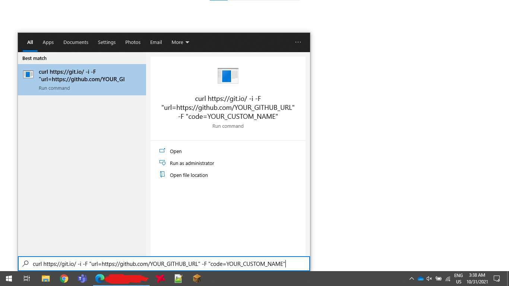

# git.io
Git.io is used for shortening GitHub URL's. If you go to the [git.io](https://git.io/) homepage, you enter the URL you want to shorten and it randomly generates a git.io URL. However, you can use [curl](https://curl.se/) to make a custom URL. Pretty cool, eh?

# Curl
If you don't know how to use curl, well than today is your lucky day! I will teach you how to use a specific part of it. To run curl (the only way I know how to do it is on Windows lol), first press the windows key, then Ctrl + V, like this:

Please note that I did this at 3AM, so the results might not be good lol.

# Custom URL
Basically what you have to do is this:
```shell
curl https://git.io/ -i -F "url=https://github.com/YOUR_GITHUB_URL" -F "code=YOUR_CUSTOM_NAME"
```
So say I wanted to generate a custom URL to my homepage, https://github.com/DaCuteRaccoon. So the url parameter is `https://github.com/DaCuteRaccoon`. I want my custom url to be https://git.io/DaCuteRaccoon. So I do:
```shell
curl https://git.io/ -i -F "url=https://github.com/DaCuteRaccoon" -F "code=DaCuteRaccoon"
```
That's all you have to do! Good luck!
---
You can find all my custom URLs [here](src/urls/urls.md).
